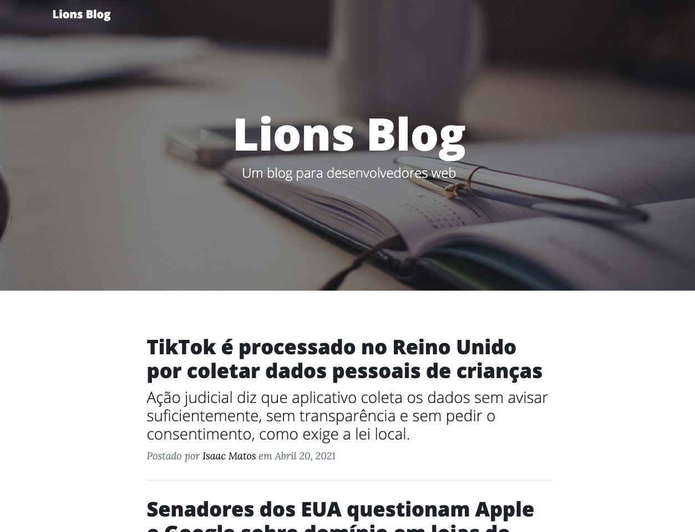

# Um projeto construído durante matéria de HTML e CSS da Pós Graduação Desenvolvimento Web Full Stack - Puc Minas.

## Demonstração

## 🚀 Tecnologias utilizadas

O projeto foi desenvolvido utilizando as seguintes tecnologias

- [HTML]
- [CSS]

## Author

**Isaac Matos**

## Encontre-me nas redes sociais:

- 🌍 [Linkedin](https://www.linkedin.com/in/isaac-matos-568b6911a/)
- 🌍 [Twitter](https://twitter.com/ic_matos)
